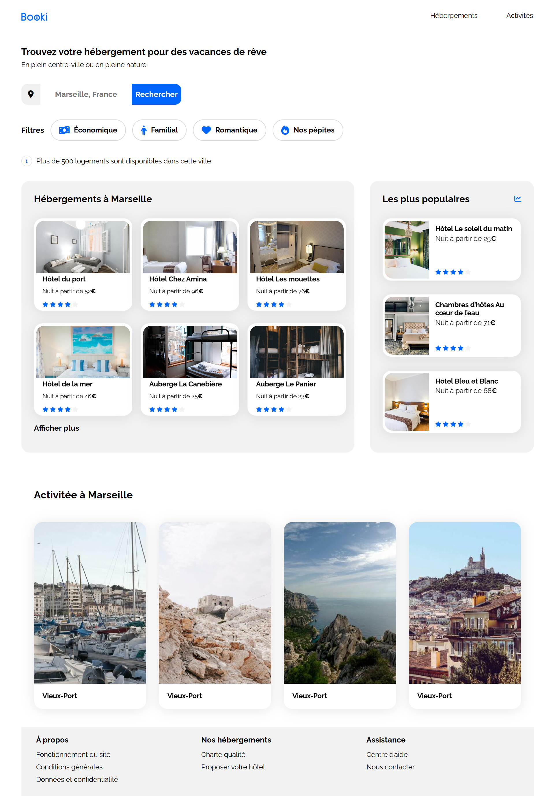

# Agence de Voyage – Page d’accueil

## Présentation générale
Projet de création d’une page d’accueil responsive en **HTML & CSS**, réalisé dans le cadre de ma formation OpenClassrooms.

---

## Visuels
📸 **

---

## Technologies utilisées
- HTML5
- CSS3
- Git & GitHub
- Responsive Design

---

## Fonctionnalités principales
- **Header** avec logo et navigation
- **Formulaire de recherche** avec champ de saisie et bouton
- **Filtres interactifs** pour affiner la recherche
- **Section Hébergements** avec cartes dynamiques
- **Section Activités** pour mettre en avant les lieux touristiques
- **Footer** avec liens complémentaires
- **Responsive design** adapté desktop et tablette

---

## Installation / Utilisation
```bash
# Cloner le projet
git clone git@github.com:magniermickael/CreezLaPageAccueilPourAgenceDeVoyageAvecHTMLetCSS.git

# Ouvrir le fichier dans un navigateur
index.html
```

---

## Journal de bord

### Étape 1 – Initialisation du projet
- Clonage du dépôt starter d’OpenClassrooms.
- Création du dépôt GitHub et ajout du remote.
- Mise en place de Gitflow avec `main` et `develop`.

### Étape 2 – Analyse de la maquette
- Découpage de la maquette Figma en sections logiques (header, search, filtres, cartes, activités, footer).

### Étape 3 – Développement du header
- Création de la branche `feature/header`.
- Intégration HTML/CSS du header.
- Commit, push et fusion sur `develop`.

### Étape 4 – Formulaire de recherche
- Création de la branche `feature/search-formulaire`.
- Développement du formulaire.
- Validation mentor, commit, push et fusion.

### Étape 5 – Filtres
- Création de la branche `feature/filters`.
- Intégration CSS/HTML des filtres et icône d’information.
- Fusion dans `develop`.

### Étape 6 & 7 – Hébergements
- Création de `feature/card-hebergement`.
- Développement et duplication des cartes d’hébergement.
- Commit, push et fusion.
- Nettoyage des anciennes branches.

### Étape 8 – Activités
- Création de la branche `feature/activities`.
- Intégration HTML/CSS de la section Activités.
- Commit, push, fusion et suppression des branches.

### Étape 9 – Footer
- Création de la branche `feature/footer`.
- Intégration du footer.
- Commit, push et fusion.

### Étape 10 – Fix responsive
- Création de `feature/responsive-fix`.
- Correction des bugs sur écrans 1024px.
- Commit, fusion et nettoyage des branches.

### Étape 11 – Finalisation
- Création de la branche `feature/fusion-final`.
- Fusion de `develop` dans `main`.
- Push final et suppression des branches obsolètes.

---

## Documentation projet
- Structure HTML pensée pour la **sémantique** et l’accessibilité.
- Utilisation de **Flexbox** pour respecter la maquette et fluidifier la mise en page.
- Responsive design progressif (desktop → tablette → mobile).

---

## Démo
🌍 *https://magniermickael.github.io/CreezLaPageAccueilPourAgenceDeVoyageAvecHTMLetCSS/*  
✅ **

---

## Crédits
👨‍💻 Auteur : **Mickaël Magnier**  
- GitHub : [magniermickael](https://github.com/magniermickael)  

